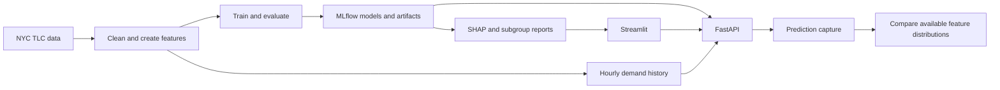

# System Architecture

## Data and Models

The pipeline downloads NYC TLC records, cleans invalid observations, and builds
two tables with different grains. Fare keeps one trip per row; demand creates
one pickup-zone/hour row including zero-count hours. Demand history is shifted
before lag and rolling features are calculated. Both branches use chronological
80/10/10 row splits by default.

Training compares XGBoost and LightGBM using validation RMSE. Each estimator
logs parameters, validation/test scores and its model in MLflow. The selected
winner receives SHAP plots and a model card. The training command registers
winners by default; `--no-register` skips registration while retaining tracked
runs and artifacts. SQLite holds metadata; `mlruns/` holds artifact files.

## Serving

The API loads both registered models and dense demand history into a shared
service. Typed requests call reusable inference functions. The dashboard uses
HTTP rather than implementing a second prediction system. Batch forecasting
recursively extends per-zone history and appends results to SQLite.

## Evidence and Automation

The API emits prediction capture events; managed monitoring can transport and
analyze them when cloud infrastructure is explicitly configured. The local
drift generator uses controlled samples instead. PSI drives feature flags;
KS supplies additional distribution context. Input drift alone is not accuracy
loss, and performance measurement requires correctly matched actual outcomes.

The optional retraining pipeline coordinates training, evaluation, quality gates
and an explicitly authorized release. Scheduled runs pass deployment permission
as false. There is no direct drift-alarm-to-retraining trigger in the template.

For AWS, ECR stores images, ECS Fargate runs the API, and the HTTP ALB routes
traffic. CodeBuild can lint/test, build, push and request an ECS update. Build
success alone does not prove stability; use separate runtime checks. Local
operation does not require any of these cloud services.