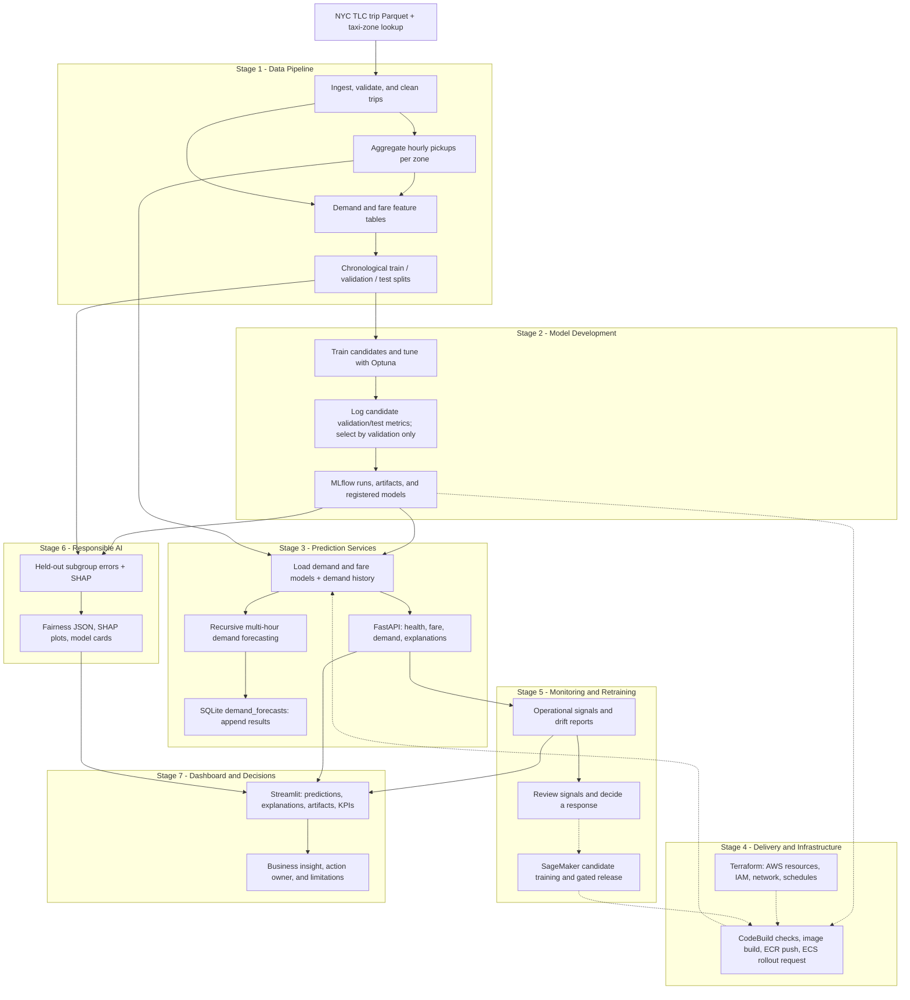
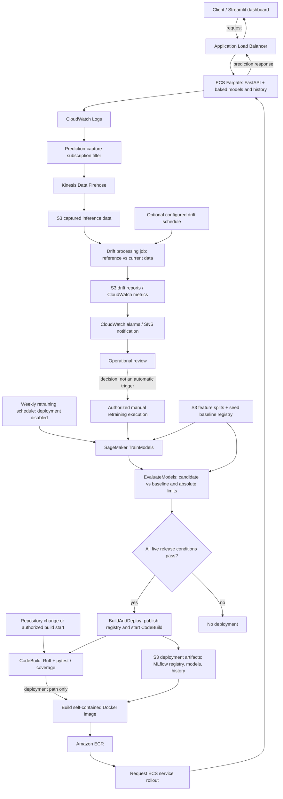

# Project Architecture: Taxi Demand and Fare Prediction

This document describes the implemented project structure, not a fresh verification
of deployed AWS resources. The seven stages are a teaching sequence; serving,
monitoring, analysis, and reporting also operate alongside one another.

## Business Questions

- **Demand:** How many pickups are expected in a taxi zone for a future hour?
- **Fare:** What fare is predicted from a trip's distance, locations, time, and passengers?

## Seven-Stage Overview

Solid arrows represent data or artifact dependencies. Dotted arrows represent
review, release, or optional publication steps, not automatic runtime triggers.

The Stage 5 box combines separate signal paths: request capture supports hosted
monitoring, while local synthetic drift reports can be generated independently.
It does not mean every API request directly computes a drift report.

## Stage Responsibilities

| Stage | Main work | Outputs and implementation |
| --- | --- | --- |
| **1. Data pipeline** | Download/cache TLC data; clean trips; aggregate demand; create lag, rolling, calendar, and trip features; split chronologically | Parquet datasets and pipeline summary. [Pipeline entry point](../scripts/run_pipeline.py) |
| **2. Model development** | Train candidates for both problems; tune settings; compare validation metrics; evaluate; log and optionally register models | MLflow runs, model artifacts, evaluation evidence. [Training entry point](../scripts/train_models.py), [training implementation](../src/models/train.py) |
| **3. Prediction services** | Load registered models; validate requests; calculate predictions; recursively forecast demand in batch | JSON API responses and SQLite forecast rows. [API](../src/serving/api.py), [registry loader](../src/serving/registry.py), [batch implementation](../src/serving/batch.py) |
| **4. Delivery and infrastructure** | Test and lint code; package models and history with the application; publish image; request ECS rollout; declare AWS infrastructure | Self-contained serving image and configured infrastructure. [CodeBuild specification](../buildspec.yml), [Dockerfile](../docker/Dockerfile), [Terraform](../infra/terraform/main.tf) |
| **5. Monitoring and retraining** | Inspect service health and drift; capture inference data; alert; train and evaluate candidates through explicit gates | Drift reports, operational evidence, and conditional model releases. [Monitoring infrastructure](../infra/terraform/monitoring.tf), [retraining pipeline](../retraining/pipeline.py) |
| **6. Responsible AI** | Calculate held-out subgroup metrics; explain fitted-model behavior; document intended use and limitations | Fairness reports, SHAP images, model cards. [Analysis entry point](../scripts/responsible/run_analysis.py) |
| **7. Dashboard and decisions** | Combine API responses with stored analysis/drift evidence; explain a stakeholder decision | Streamlit views and business reporting. [Dashboard](../dashboard/app.py), [source configuration](../dashboard/config.py), [business report](BUSINESS_REPORT.md) |

## AWS Runtime, Delivery, and Feedback

Terraform declares the infrastructure around these flows. Diagram arrows describe
the configured or implemented route, not proof of current traffic or successful
delivery. Optional resources depend on deployment flags and supplied images.

### Release and Evidence Boundaries

- **SageMaker trains; ECS serves.** This serving route does not require an
  always-on SageMaker inference endpoint.
- **The retraining release gate checks five conditions:** demand RMSE limit,
  fare RMSE limit, demand baseline comparison, fare baseline comparison, and
  `DeployAfterQualityGate=true`. The weekly no-deploy route cannot satisfy the
  authorization condition. See the [pipeline definition](../retraining/pipeline.py).
- **A drift alert does not automatically deploy a model.** Notification,
  investigation, candidate evaluation, and release authorization are distinct.
- **The model gate belongs to the retraining path.** Normal CodeBuild deployment
  has its own trigger rules; do not imply every repository deployment passes
  through the SageMaker model gate.
- **CodeBuild requests a rollout.** Its current buildspec does not itself wait
  for ECS stability or run post-deployment smoke tests. Check service, target,
  and application health separately.
- **The dashboard is not one live data feed.** API responses are request-time
  evidence; fairness, SHAP, model-card, and drift panels read stored files.
  S3-sourced files can be staged locally before display.
- **Batch is a separate consumer.** It appends forecasts to SQLite; this diagram
  does not claim that the dashboard reads those rows. The current batch writer's
  default `latest` label is not immutable numeric model-version lineage.
- **Responsible AI supports review, not automatic clearance.** SHAP is not
  causation, and geographic/temporal error differences do not establish
  demographic fairness or prove mitigation success.

## Local Classroom Route

Use [the setup guide](SETUP.md) to prepare dependencies and execute:

1. **Data:** ingest and build both problems' feature splits.
2. **Models:** train and register models. A `--no-register` exercise does not
   satisfy the registry prerequisite for analysis or API startup.
3. **Predictions:** start FastAPI; inspect health and valid/invalid requests;
   run batch demand forecasting separately.
4. **Quality:** exercise local lint/tests; inspect the cloud delivery path
   without requiring a student deployment.
5. **Monitoring:** generate and interpret local synthetic drift evidence.
6. **Responsible AI:** generate/read subgroup reports, SHAP, and model cards.
7. **Communication:** start Streamlit and present a question, evidence, action,
   owner, and limitation.

AWS, Docker, and a student cloud account are not required for this local route.
The AWS diagram is the hosted extension, not a prerequisite for understanding
or practicing the project lifecycle.